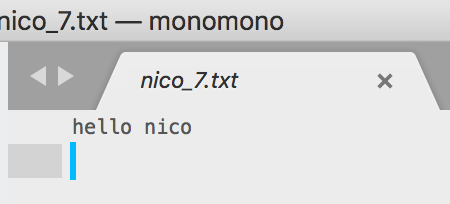

Random file generator based on templates and random inputs from mapping definition.

# simple example

```bash
java -jar monomono.jar -g hello.clj -o hello -r `pwd`/samples
```

where:
- g: is the generator file
- o: is the output folder
- p: use pooled generation
- c: clean the target folder before running
- r: absolute path to templates

The generator file samples/hello.clj contains a mapping-fn and a naming-fn definition.

The mapping-fn returns a map of keys and how to generate random values for each keys.

The naming-fn will be used to create the file name of the generated output.


```clojure
(def count (atom 0))
(defn mapping-fn []
  (swap! count inc)
  {:person (rand-nth ["nico" "chris" "jb" "taka"]) :id @count})

(defn naming-fn [output-folder mappings]
  (str output-folder "/" (mappings :person) "_" (mappings :id) ".txt"))

[10 "hello.md" naming-fn mapping-fn ]
```

and *hello.md*, the template is

```
hello {{person}}
```

The last line of the generator file is a vector of items in the pattern:

```clojure
[<nb_of_items_to_be_generated> <template_file> <naming-fn> <mapping-fn>]
```

or a vector of vector:

```clojure
[
[<nb_of_items_to_be_generated> <template_file> <naming-fn> <mapping-fn>]
[<nb_of_items_to_be_generated> <template_file> <naming-fn> <mapping-fn>]
...
]
```

Once the generator is run, it will output 10 files, as seen below:


where one file is as below:



# second example


The command is used as below:

```bash
java -jar monomono.jar -g gen0.clj -o gen0 -p -c -r `pwd`/resources
```

```clojure
(defn mapping-fn []
  {:currency1 "JPY"
   :currency2 "JPY"
   :initialValue
   (rand-nth [100000000 10000000000 1000000000000 100000000000000])})

(defn naming-fn [output-folder mappings]
  (str
    output-folder
    "/xs_swap_"
    "JPY"
    (mappings :initialValue) "_"
    (System/currentTimeMillis) ".xml"))

[20 "xs_swap.xml" naming-fn mapping-fn ]
```

